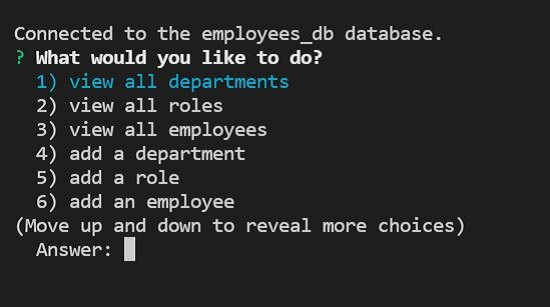
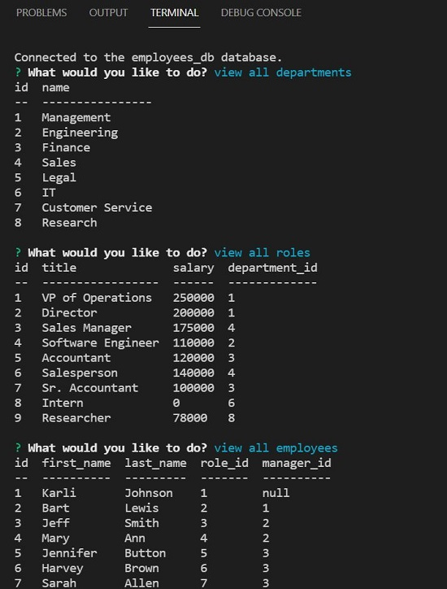
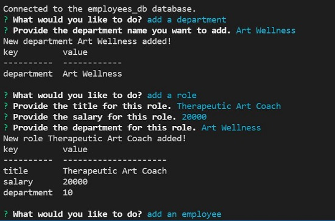
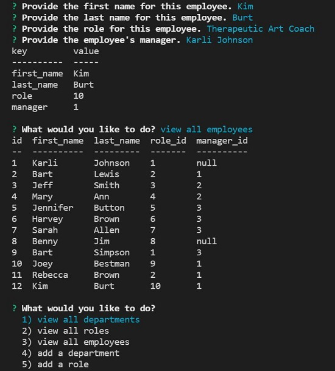

# employee-tracker

## Description
Designed a command-line application from scratch to manage a company's employee database, using Node.js, Inquirer, and MySQL.

## Table Of Contents
[Links](#links)

[Installation](#installation)

[Instructions](#instructions)

[Usage](#usage)

[Screenshots](#screenshots)

[License](#license)

## Links
[App Code](https://github.com/asantercureton/employee-tracker)

[Video Recording](https://watch.screencastify.com/v/bcEH6IpfKxxVb7YbXZlt)

## Installation
Run "npm install" at root directory

Then run "mysql -u root"

Then run "soucre db/schema.sql"

Then run "source db/seeds.sql"

Then run "exit" to create the database and seed the tables.

## Instructions
Run "npm start" to intiate the employee tracker application.

## Usage
Designed to allow a company manage a it's employee database and be more efficient with their employmee management system.

## Screenshots
Below is a screenshot of the project:

## License

---
© 2021 Employee Tracker App.